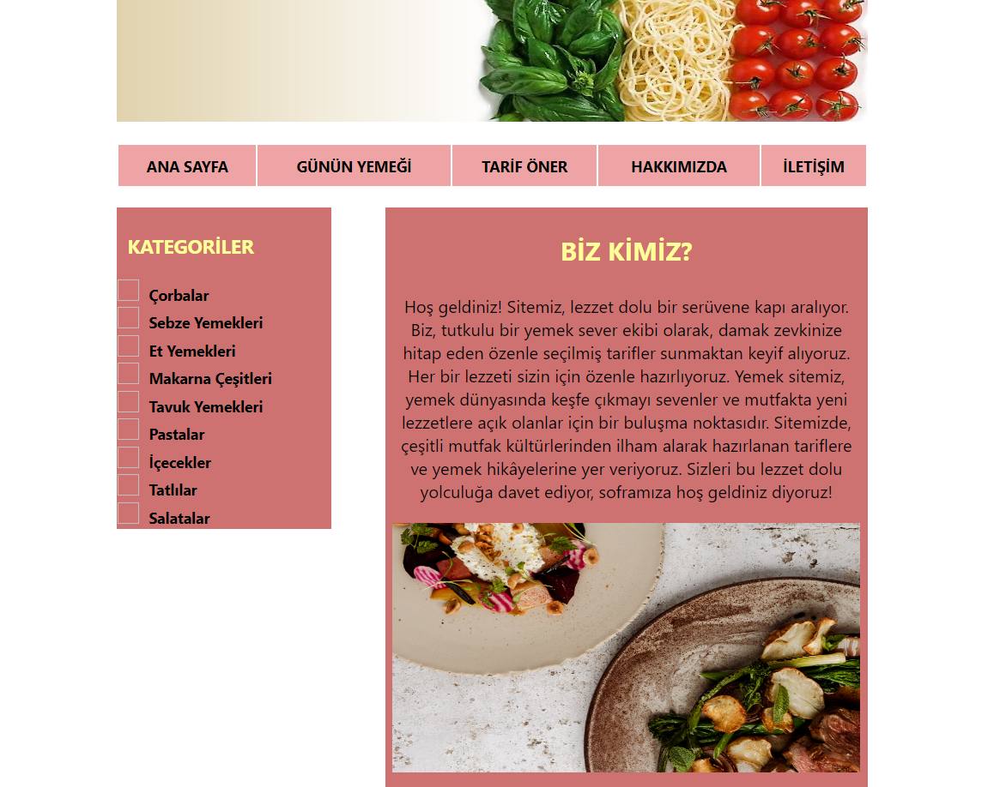
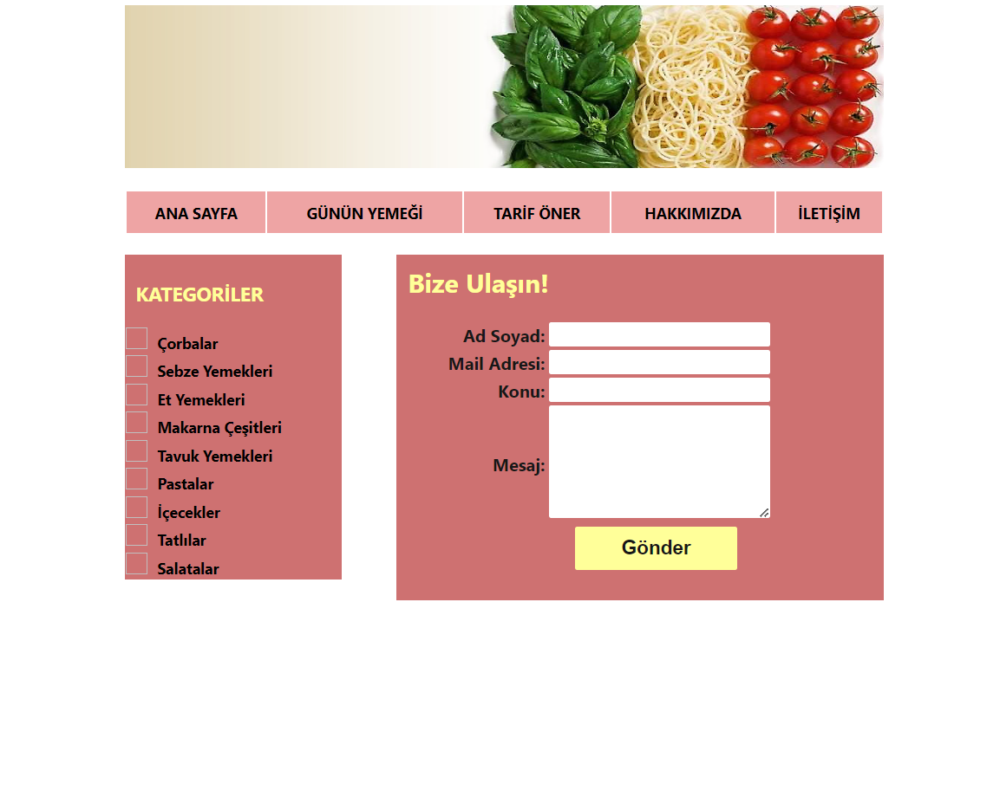
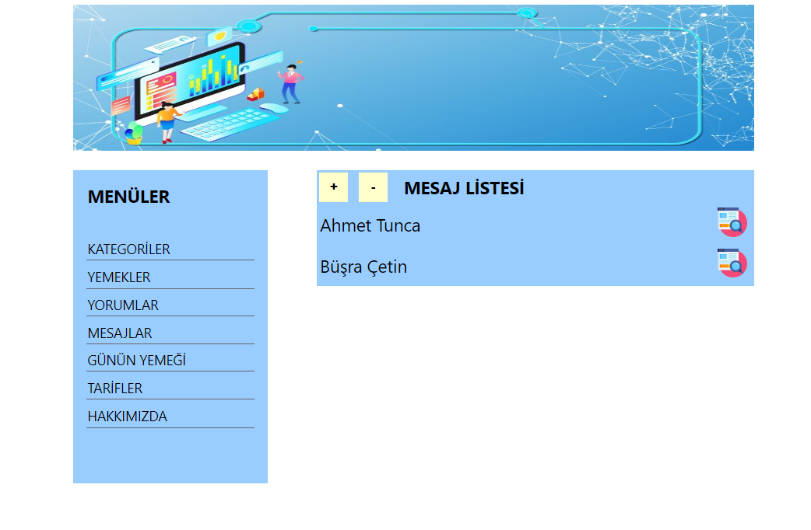

# Yemek Tarifleri Sitesi

- Murat Yücedağ'ın YouTube'da yer alan 50 Derste Asp.Net ile Yemek Tarifi Sitesi eğitiminde oluşturmuş olduğum projeye ait repodur.
- Tasarımda bana ait değişiklikler bulunmaktadır.

### Kullanılan Teknolojiler
- C#
- HTML
- CSS
- Asp.Net
- SQL

### Kullanılan Programlar
- Visual Studio 2022
- Microsoft SQL Server Studio

### Projeye Ait Görseller

---

Aralık 2023
